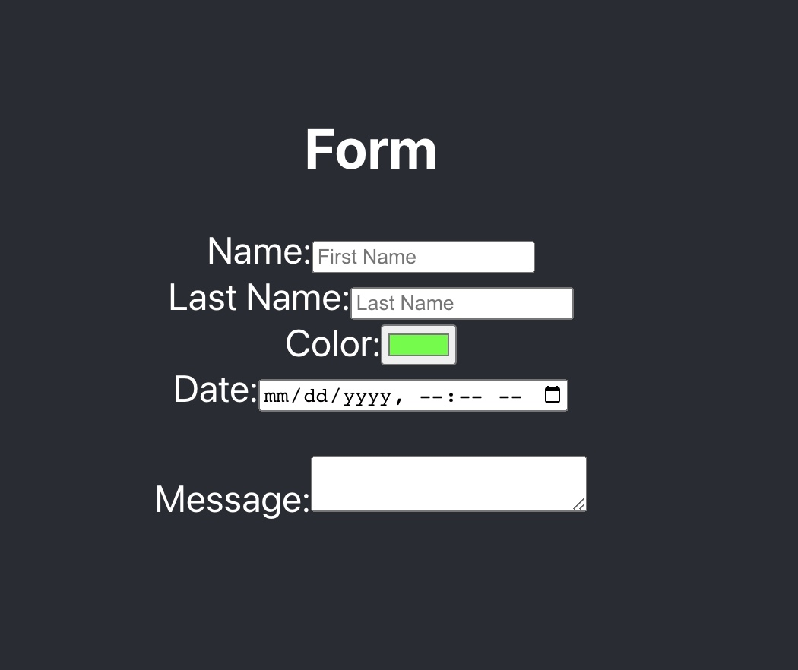

# Form Practice - React.js App
building a react app with Onchange functionality for an HTML form for BocaCode c-10 in class practice.

## Demo Link
[link to demo](http://localhost:3000/?)

## covered In Class
* Onchange
* Form Elememts
* Controlled Components 